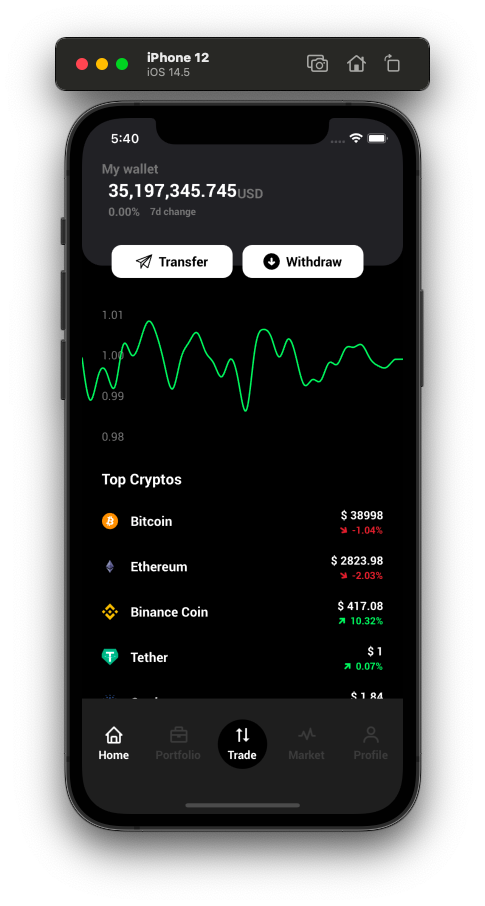
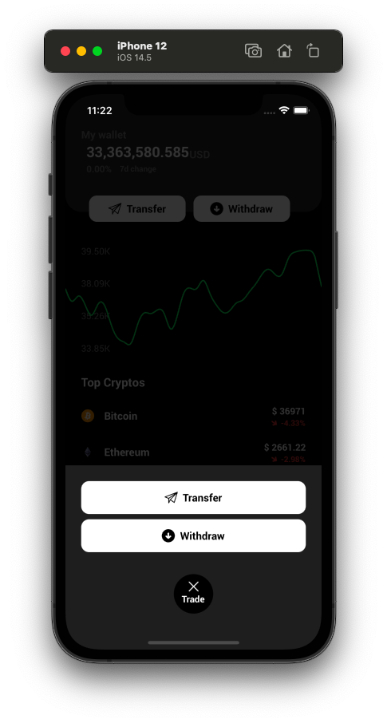

<h1 align="center">Welcome to NoWallet 👋</h1>
<p>
  
  <a href="#" target="_blank">
    
  </a>
</p>

> a Simple Crypto Wallet app

## Install

```sh
npm install
cd ios
pod install
```

## Usage

```sh
npx react-native run-ios
```

## Screenshots





## Author

👤 **akecha**

* Github: [@akecha](https://github.com/akecha)

## Show your support

Give a ⭐️ if this project helped you!
